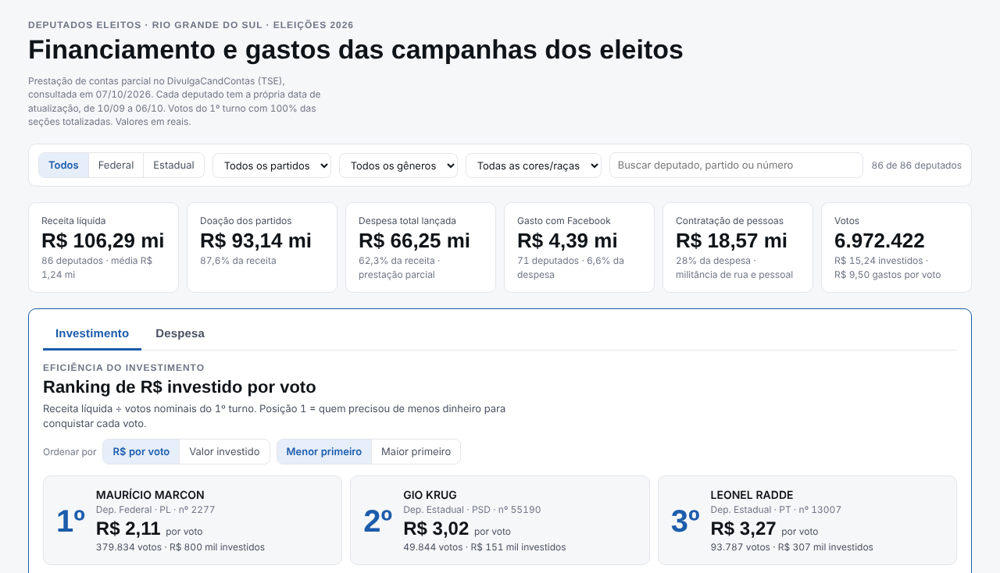
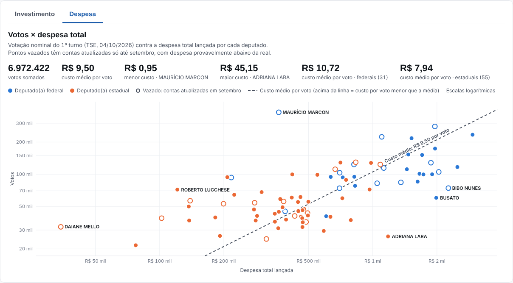

# Financiamento das campanhas dos deputados eleitos no RS (2026)

Dashboard interativo com a receita, a despesa e o custo por voto dos 86 deputados eleitos pelo Rio Grande do Sul em 2026: 31 deputados federais e 55 estaduais. Os dados vêm da prestação de contas parcial publicada pelo TSE e da votação do 1º turno.



## O que tem no dashboard

- **Indicadores gerais**: receita líquida, doação dos partidos, despesa total lançada, gasto com Facebook, gasto com contratação de pessoas e votos.
- **Ranking de R$ por voto**, com as abas **Investimento** (receita líquida ÷ votos) e **Despesa**. Na aba Despesa dá para ver a despesa total, o gasto com Facebook e o gasto com contratação de pessoas, ordenando por R$ por voto, pelo valor ou pela fatia da despesa.
- **De onde veio o dinheiro**: composição da receita por origem.
- **Candidaturas × recursos do partido**: compara a participação de mulheres, pessoas negras e pessoas brancas entre os eleitos com a fatia que esses grupos receberam da doação dos partidos.
- **Votos × dinheiro**: dispersão em escala logarítmica, com abas para receita ou despesa.
- **Recursos e despesas por candidato**: barras empilhadas por origem da receita ou por tipo de gasto.
- **Base completa**: tabela com todos os deputados, ordenável por qualquer coluna.

Os filtros de cargo, partido, gênero, cor/raça e a busca por nome ou número valem para todos os painéis.



## Estrutura

```
.
├── dados/
│   ├── originais/        planilhas .xlsx de origem (fora do Git: têm CPFs completos)
│   ├── extraidos/        abas das planilhas em CSV, com CPFs mascarados
│   └── processados/      base consolidada, uma linha por deputado (CSV e JSON)
├── docs/                 site do dashboard (é o que o GitHub Pages publica)
│   ├── index.html
│   └── assets/
│       ├── css/estilo.css
│       ├── js/app.js     gráficos, filtros e tabela
│       ├── js/dados.js   dados gerados pelo script 02
│       └── img/
├── scripts/
│   ├── 01_extrair_planilhas.py
│   └── 02_consolidar_dados.py
└── requirements.txt
```

O dicionário das colunas está em [`dados/README.md`](dados/README.md).

## Como ver no computador

Abra `docs/index.html` no navegador. Não precisa de servidor nem de instalar nada.

## Como atualizar os dados

Requer Python 3.9 ou mais recente.

```bash
pip install -r requirements.txt

# coloque as planilhas novas em dados/originais/ (veja dados/originais/LEIA-ME.md)
python scripts/01_extrair_planilhas.py   # xlsx -> dados/extraidos/*.csv, com CPFs mascarados
python scripts/02_consolidar_dados.py    # CSVs -> dados/processados/ e docs/assets/js/dados.js
```

O script 02 confere, deputado a deputado, se as somas das listas batem com os totais do TSE (despesas por tipo e por fornecedor, receitas por origem e por doador) e para com erro se alguma conta não fechar.

## Como publicar no GitHub Pages

1. Envie o projeto para um repositório no GitHub.
2. Em **Settings → Pages**, escolha **Deploy from a branch**, a branch `main` e a pasta `/docs`, e salve.
3. Em alguns minutos o dashboard fica no ar em `https://<seu-usuario>.github.io/<nome-do-repositorio>/`.

## Metodologia

- **Investimento (receita líquida)**: total recebido pela campanha, descontadas as receitas devolvidas. Inclui recursos estimáveis (bens e serviços doados, sem dinheiro).
- **Despesa total**: total de despesas exibido pelo TSE, incluindo as doações feitas a outros candidatos ou partidos.
- **R$ por voto**: investimento ou despesa dividido pelos votos nominais do 1º turno.
- **Facebook**: soma dos pagamentos a FACEBOOK SERVICOS ONLINE DO BRASIL LTDA., identificado pelo CNPJ 13.347.016/0001-17.
- **Contratação de pessoas**: soma dos tipos de despesa "Atividades de militância e mobilização de rua" e "Despesas com pessoal", como cada campanha classificou na prestação. Pagamentos lançados como "Serviços prestados por terceiros" ficam de fora, mesmo quando feitos a pessoas físicas. Para comparar, a base traz também o total pago a pessoas físicas (CPF) e quantas pessoas receberam.
- **Doação dos partidos**: repasses de direções partidárias nacionais, estaduais e municipais.
- **p.p. (pontos percentuais)**: no painel Candidaturas × recursos do partido, é a diferença entre a fatia do grupo na doação dos partidos e a fatia do grupo entre os eleitos. Exemplo: as mulheres são 24,4% dos eleitos e receberam 28,0% da doação dos partidos, o que dá +3,6 p.p.

### Limitações

- As prestações de contas são **parciais**. A prestação final é entregue depois da eleição e os números vão mudar.
- Cada deputado tem a própria data de atualização, entre 10/09 e 06/10/2026. Na consulta de 07/10/2026, 27 deles estavam com dados de setembro e tendem a aparecer com despesa abaixo da real. O dashboard marca esses casos com "contas de dd/mm".

## Fontes

- Prestação de contas: [DivulgaCandContas (TSE)](https://divulgacandcontas.tse.jus.br/), consulta em 07/10/2026.
- Votação: [Resultados (TSE)](https://resultados.tse.jus.br/), Eleições Gerais 2026, 1º turno, Rio Grande do Sul, com 100% das seções totalizadas em 04/10/2026.

## Privacidade

O TSE publica o CPF de doadores e fornecedores pessoas físicas. Neste repositório os CPFs aparecem mascarados (`***.456.789-**`), inclusive quando vêm dentro do nome de um MEI. As planilhas originais, com os CPFs completos, ficam fora do Git (veja `.gitignore`).
